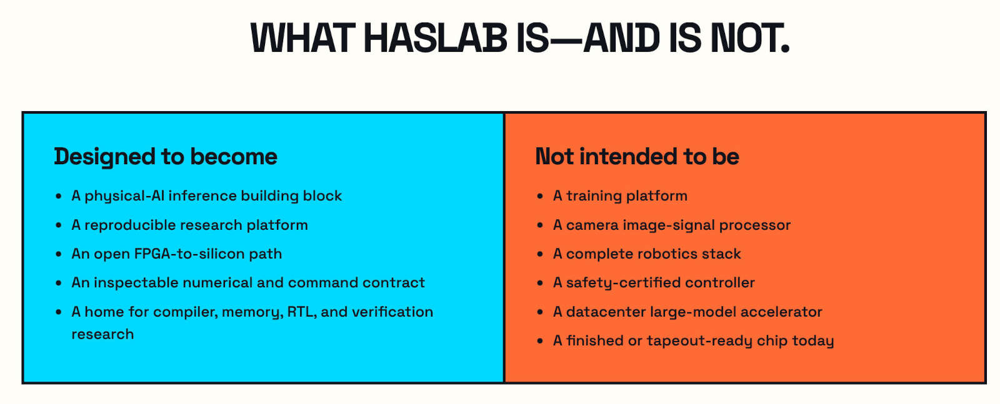
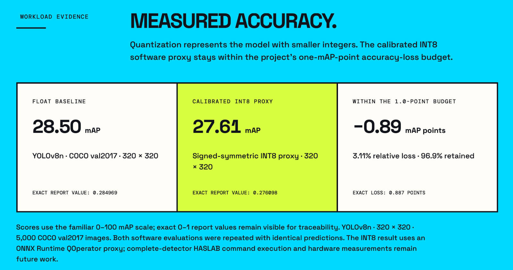
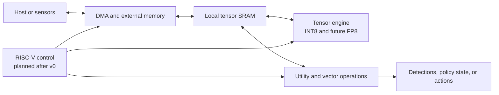

# HASLAB

> **Open silicon for edge intelligence.**

Website: [haslab-site.pages.dev](https://haslab-site.pages.dev/)

HASLAB is an open-source physical-AI inference-engine project for computer vision, robotics, and edge AI. Its aim is to create a programmable, inspectable path from a trained neural network to hardware that researchers can simulate, study, modify, place on an FPGA, and eventually fabricate as silicon.

```text
PyTorch or another framework
          ↓ export
         ONNX
          ↓ compile and lower
  HASLAB model package
          ↓ execute
Reference model → simulator → FPGA → open ASIC flow → silicon
```

HASLAB is being designed in public from the numerical contract upward. The project begins with exact software models and bounded interfaces before committing them to RTL. This lets future hardware be checked against an independent golden model instead of defining correctness after the circuit is built.

## Current status

**Stage: v0 contract candidate and conformance corpus implemented; calibrated workload complete; minimal compiler/runtime active.**

The repository currently contains an architecture specification, an executable Python golden model, a byte-level command simulator, 46 independently authored binary conformance fixtures with a strict runner, and a pinned YOLOv8n workload with reproducible FLOAT and calibrated INT8 software baselines. The compiler/runtime path now executes nodes 0–136 through the complete backbone and both top-down neck C2f stages. Its reusable graph IR emits diagnostic and release packages; deterministic lifetime reuse reduces peak output storage from 4,608,000 to 665,600 bytes while preserving the long-lived `model.6` and `model.4` skip tensors. The diagnostic path matches all 5,145,600 compared INT8 values exactly, and the release package matches the independently evaluated 102,400-value neck output. The current partial schedule contains 277,436 fixed commands, or 35,511,808 command bytes per inference, so practical command delivery remains an explicit pre-RTL gate rather than a performance claim. The repository does not yet contain a whole-model ONNX compiler, production runtime, tensor-accelerator RTL, FPGA bitstream, ASIC implementation, or end-to-end YOLO execution through HASLAB commands or hardware.

| Component | Status | What that means |
|---|---|---|
| Architecture and v0 contract | Freeze candidate | Document revision 0.2 reviewed against the software models; independent review and command-delivery resolution remain open |
| Python numerical model | Implemented and unit-tested | Defines FP8/INT8 conversion, accumulation, tensor operations, layouts, and edge cases |
| Functional command simulator | Implemented and unit-tested | Executes the proposed 128-byte command ABI over modeled memory spaces |
| v0 contract freeze | Active | ABI 0.1 candidate has conformance evidence; stable freeze awaits independent review and a practical command-delivery decision from the complete schedule |
| v0 conformance package | Candidate implemented and tested | 46 stored command/memory/status fixtures, machine-readable ABI registry, integrity checks, and CI runner; final release tied to ABI freeze |
| Pinned YOLO-class workload | Pinned and measured in software | Exact weight/export, graph inventory, preprocessing, partition, FLOAT baseline, deterministic INT8 calibration package, layerwise diagnostics, and proxy COCO accuracy are tracked |
| ONNX importer and compiler | Reusable graph through both top-down neck stages | Nodes 0–136 cover dynamic legal tiles, convolution, residual and non-residual C2f blocks, split views, scaled merge operations, MaxPool, exact 2× upsampling, long-lived skip tensors, streamed parameters, and deterministic liveness allocation; bottom-up neck and head lowering stay open |
| Runtime | Graph-package simulator backend implemented | Strictly loads the experimental package, binds input, submits 277,436 commands with measured FIFO refills, exposes diagnostic or release outputs, waits, resets, and reports detailed errors; no C/FPGA or host-tail backend yet |
| RTL and RTL testbenches | Planned | No hardware implementation exists yet |
| FPGA target | Planned | No board has been selected or benchmarked |
| ASIC flow and fabrication kit | Future | No design is currently ready to fabricate |

Run all currently implemented verification with:

```sh
make check
make test
```

For a smaller first experiment, run `make conformance` and inspect the [fixture format](conformance/FORMAT.md), or run `make sim` and read the [command simulator guide](simulation/README.md). The pinned YOLOv8n [reproduction guide](benchmarks/manifests/yolov8n-320-opset13/README.md) covers the more involved model and dataset workflow; third-party weights are not stored here.

The current test suite covers the numerical model, functional command simulator, compiler/package writer, strict runtime loader and lifecycle, conformance infrastructure, stored independent expectations, and workload-manifest consistency. Run `make conformance` for the corpus alone. Passing establishes agreement for the tested cases; it is not an FPGA or silicon performance result. See the [conformance guide](conformance/README.md) for coverage and derivations.

### Progress at a glance

- [x] Establish the repository structure, documentation, licensing, and development checks.
- [x] Implement and test the numerical golden model.
- [x] Implement and test the functional command simulator.
- [x] Review the v0 contract against the software models, fix discrepancies, and record the ABI candidate decisions.
- [ ] Freeze the stable v0 ABI after independent review, conformance evidence, and command-delivery resolution.
- [x] Build the candidate independent conformance corpus, ABI registry, and CI runner.
- [ ] Release the final conformance corpus after stable ABI freeze and independent review.
- [x] Pin and audit the first YOLO-class workload, including reproducible FLOAT accuracy and a calibrated INT8 software proxy inside the one-point mAP50–95 budget.
- [ ] Implement the minimal compiler and simulated runtime path. **Active: nodes 0–136 pass through both top-down neck C2f stages; nodes 137–154 through the first bottom-up neck branch are next.**
- [ ] Implement and differentially verify the first RTL vertical slice.
- [ ] Expand RTL operation coverage one conformance-gated operation at a time.
- [ ] Select an FPGA from measured resource probes, complete stored-image bring-up, and measure the live camera-to-detection path.
- [ ] Run a second pinned perception model on the same bitstream and publish the cost of reprogramming it.
- [ ] Evaluate RISC-V control and native FP8 for v1 using measured v0 and multi-workload evidence.
- [ ] Begin ASIC feasibility only after the FPGA design is stable and measured.

The detailed [development plan](docs/development-plan.md) is the status record for dependencies, checklists, exit criteria, and evidence. The README checklist is updated when milestone status changes.

Future hardware performance reports should follow the [measurement protocol](benchmarks/MEASUREMENT.md).

The [contract review record](docs/reviews/v0-contract-review.md) explains the corrected simulator defects and remaining workload, package, and transport gates. The current candidate is **command ABI 0.1 / contract document revision 0.2**; these are separate versions. No RTL has been written.

## Why physical AI?

Physical-AI systems turn sensor data into decisions under real latency, power, memory, and reliability constraints. Examples include robots, autonomous instruments, inspection systems, smart cameras, laboratory equipment, and embedded perception nodes.

Many accelerators expose impressive peak arithmetic while leaving model conversion, data movement, preprocessing, control, and reproducibility as separate problems. HASLAB treats the complete inference path as the engineering object:

- Move tensors explicitly through DMA and local SRAM.
- Execute modern quantized vision operations with documented numerical behavior.
- Keep the model format separate from the hardware command interface.
- Use standard ONNX export rather than asking users to rewrite networks manually.
- Expose unsupported operations and host partitions instead of hiding fallback work.
- Measure complete latency and data movement, not only theoretical operations per second.
- Preserve a path from university-scale FPGA work to an open, physically realizable ASIC.

HASLAB is an inference engine, not a training platform, camera ISP, safety-certified controller, or complete robotics stack. It is intended to become a reliable perception and policy-inference building block inside those larger systems.



## Target workloads

The primary target is batch-one edge vision:

- Modern YOLO-class object detection
- Contemporary compact CNNs
- Robotics perception pipelines
- Small policy and decision networks
- Sensor-processing plus neural-network inference

Compact vision transformers and edge transformers are later research targets where operator coverage and memory traffic prove practical. Large-model training and datacenter LLM inference are outside the initial scope.

The implementation priority is the complete detector and a measured live perception path. A second vision model should then demonstrate reprogramming on the same FPGA image. Small policy or other inference workloads remain valid later experiments when they fit the measured operator and memory envelope without displacing the vision work.

The first end-to-end workload candidate is a pinned YOLOv8n detector at 320×320. Its exact third-party weight, FLOAT ONNX export, preprocessing, complete graph inventory, learned-head/host-tail boundary, and calibration package are recorded in the [workload manifest](benchmarks/manifests/yolov8n-320-opset13/README.md). The proposed FPGA path executes the quantized backbone, neck, and learned detection head, while the host performs declared image preparation and final box decoding/DFL/NMS. The structural audit found no unsupported accelerator nodes and all proposed convolution tiles fit local memory. Repeated full COCO val2017 evaluations measured **28.50 COCO bbox mAP50–95** for FLOAT and **27.61** for the signed-symmetric INT8 software proxy, a 0.887-point loss within the stated one-point budget. Nodes 0–136 now pass exact command-level diagnostic comparison across 67 materialized or aliased boundaries, including SPPF, both top-down nearest-neighbor upsampling stages, long-lived backbone skips, and non-residual neck C2f blocks; bottom-up neck, learned-head, host-tail, and hardware execution remain unimplemented.



## Architecture direction

The long-term architecture combines an INT8/FP8 tensor engine, explicit SRAM and DMA, a bounded vector/utility datapath, and a small RISC-V control core.



The proposed v0 stays deliberately small: eight INT8 output-channel MAC lanes, INT32 accumulation, roughly 52 KiB of logical local storage, serialized DMA, and host control. It prioritizes a complete, inspectable detector path over peak throughput. Native FP8 and integrated RISC-V control belong to later stages after INT8 correctness and workload feasibility are measured.

### Precision

| Format | Intended role | Current support |
|---|---|---|
| INT8 | Activations and weights for the first hardware path | Golden-model and command-simulator semantics implemented |
| INT32 | Exact accumulation, bias, and optional raw logits | Golden-model and command-simulator semantics implemented |
| E4M3FN FP8 | First planned native FP8 mode | Conversion and FP32-accumulated reference behavior only; no v0 device command |
| E5M2 FP8 | Optional later format | Conversion reference only |
| FP32 | Proposed FP8 accumulation and host/reference calculations | Software reference use only |
| FP16 accumulation | Possible constrained future mode | Not selected or implemented |

Numerical behavior—including ties-to-even rounding, saturation, signed zero, NaN handling, overflow rejection, accumulation order, and the SiLU lookup-table path—is documented in the [reference-model specification](reference/numerical-semantics.md).

## Choose a path through the project

### I want to study the arithmetic

Start with the [Python reference model](reference/README.md) and [numerical semantics](reference/numerical-semantics.md). This is the best entry point for quantization experiments, independent test-vector generation, and numerical review.

### I want to study the accelerator interface

Read the [v0 software/hardware contract](docs/haslab-v0-contract.md), then inspect the [functional command simulator](simulation/README.md). The simulator covers command encoding, memory spaces, DMA, accumulator lifecycle, tensor operations, completion, reset, and architectural errors.

### I want to work on FPGA implementation

Begin with the [revised architecture](docs/haslab-v0-revised-architecture.md) and hardware source-tree guidance. The RTL and FPGA areas are placeholders today. Board selection, clock target, memory bridge, resource mapping, and RTL verification must be resolved before an FPGA capability can be claimed.

### I want to explore fabrication

Treat the planned profiles below as a roadmap. There is not yet a tapeout-ready release. A fabricatable version will need frozen RTL, conformance vectors, synthesis and timing evidence, process-specific SRAM wrappers, IO and clocking, power delivery, DFT/BIST, physical verification, packaging, and a documented fabrication path.

## Planned implementation profiles

HASLAB is intended to support different levels of experimentation without forcing every group to build the largest system.

| Profile | Intended user | Planned contents | Maturity |
|---|---|---|---|
| Software/reference | Algorithms, architecture courses, compiler research | Numerical model, command simulator, future compiler backend | Numerical model and command simulator available |
| v0 FPGA core | University labs and first hardware bring-up | Host control, INT8/INT32 compute, small scratchpads, serialized DMA | Architecture only |
| v1 FPGA subsystem | Accelerator and robotics researchers | Higher measured throughput, RISC-V control, native FP8 candidate, bounded overlap | Future |
| Basic ASIC test core | Open-silicon courses and shuttle experiments | Small proven compute core, SRAM macros, simple host interface, scan/BIST | Future; configuration depends on process and shuttle limits |
| Integrated edge ASIC | Advanced university or commercial labs | Workload-sized compute/SRAM, RISC-V control, vector utilities, viable external-memory interface | Long-term research target |

The basic test core should favor portability and observability over headline performance. The integrated version should be sized from measured workloads, memory bandwidth, area, and power rather than by copying the largest FPGA configuration. Each future release should state exactly which profile, process, memories, tools, and tests it supports.

## FPGA-to-silicon roadmap

The implementation order is contract candidate → independent conformance vectors and final ABI freeze → pinned workload → compiler/runtime execution → narrow RTL slice → incremental RTL coverage → measured FPGA → evidence-driven v1 → ASIC feasibility and test silicon. See the [development plan](docs/development-plan.md) for the current status and completion gates for each stage.

No stage is considered complete solely because a demo produces plausible boxes. Numerical agreement, declared partitions, reproducible builds, and measured hardware results are required.

## Repository guide

| Area | What belongs there |
|---|---|
| [`reference/`](reference/) | Python golden model, numerical specification, and unit tests |
| [`simulation/`](simulation/) | Functional v0 command/memory simulator and future RTL harnesses |
| [`conformance/`](conformance/) | Versioned binary fixtures, independent derivations, ABI registry, and simulator conformance runner |
| [`hardware/rtl/`](hardware/rtl/) | Future portable synthesizable RTL |
| [`hardware/testbenches/`](hardware/testbenches/) | Future RTL testbenches, assertions, and checked-in vectors |
| [`hardware/formal/`](hardware/formal/) | Future protocol and state-machine properties |
| [`fpga/`](fpga/) | Future board wrappers, constraints, and reproducible builds |
| [`compiler/`](compiler/) | Reusable graph scheduling through nodes 0–136, dynamic SRAM-fit tiles, MaxPool and upsample lowering, long-lived skip tensors, streamed weights/parameters, diagnostic and lifetime-reuse allocation, and experimental `.hxb` generation; bottom-up neck and head regions remain open |
| [`onnx/`](onnx/) | Supported ONNX profile, export recipes, and operator coverage |
| [`runtime/`](runtime/) | Minimal strict package loader and simulator lifecycle; future C and platform backends |
| [`software/`](software/) | Future host utilities and RISC-V firmware support |
| [`benchmarks/`](benchmarks/) | Pinned workload manifests, audit tools, evaluation methods, and machine-readable results |
| [`docs/`](docs/) | Architecture, interface contracts, design decisions, and project guidance |
| [`scripts/`](scripts/) | Reproducible development and CI helpers |

Core reading order:

1. [Revised v0, v1, and ASIC architecture](docs/haslab-v0-revised-architecture.md)
2. [v0 software/hardware contract](docs/haslab-v0-contract.md)
3. [Numerical semantics](reference/numerical-semantics.md)
4. [Command-simulator behavior](simulation/command-simulator.md)
5. [Original broad architecture plan](docs/architecture-plan.md) for background and alternatives

## For universities and research groups

HASLAB is structured so individual projects can contribute at different layers: quantization studies, operator lowering, command scheduling, memory systems, arithmetic RTL, protocol verification, FPGA integration, physical design, or robotics evaluation. Research results should pin the repository revision, model/export artifacts, numerical profile, dataset, tool versions, and measurement conditions.

Course and thesis projects can begin with the software/reference profile without waiting for RTL. Hardware projects should add independently checked vectors and avoid changing the numerical contract merely to match an implementation bug.

## For commercial and applied laboratories

The project is intended to be inspectable and adaptable for applied research, prototypes, and commercial experimentation under its licenses. Current materials are suitable for architecture review and software-level evaluation, not product deployment. Future hardware releases should make integration boundaries, supported operations, verification evidence, tool dependencies, and process-specific collateral explicit so a lab can decide whether to reuse a core, extend a profile, or build a larger subsystem.

No safety, security, uptime, power, latency, fabrication-yield, or fitness-for-purpose guarantee is made.

## Contributing

Architecture review and numerical scrutiny are useful now. Broad implementation contributions will become easier after the initial model artifact, tool requirements, and issue workflow are pinned. A strong contribution should:

- Identify the affected specification or interface.
- Explain the workload or measurement motivating the change.
- Include tests or verification evidence appropriate to the layer.
- Preserve strict reporting of unsupported behavior.
- Avoid performance and compatibility claims without reproducible results.
- Record third-party model, dataset, PDK, IP, and tool licensing.

See the current [contribution guidance](docs/contributing.md). Design decisions that change an interface or numerical rule should eventually receive a short record under `docs/decisions/`.

## Licensing

Original hardware designs and design documentation are licensed under **CERN-OHL-S-2.0**. Original software is licensed under **GPL-3.0-or-later**. Both allow commercial use under their terms and carry reciprocal obligations in their respective scopes.

See [LICENSE](LICENSE), [NOTICE](NOTICE), and the [licensing explanation](docs/licensing.md). Model weights, datasets, PDKs, vendor IP, and other third-party materials keep their own licenses and are not automatically covered by HASLAB's licenses.

Copyright © 2026 Zubin Bhuyan and contributors.
