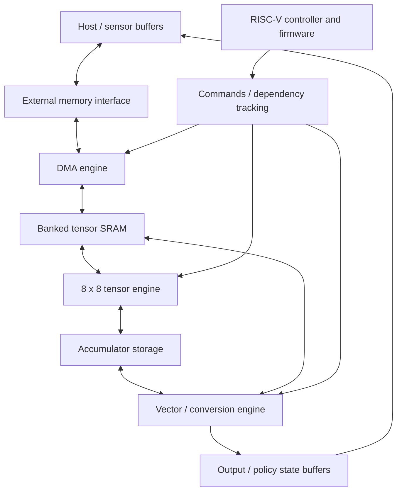

# HASLAB architecture plan

Copyright (C) 2026 Zubin Bhuyan.
SPDX-License-Identifier: CERN-OHL-S-2.0

**Open silicon for edge intelligence.**

**An open-source physical-AI inference engine for computer vision, robotics, and edge AI.**

**Target architecture:** FP8/INT8 low-latency tensor accelerator with vector/DMA processing and a RISC-V control core.

Status: original proposal, September 20, 2026. The implementation baseline is superseded by [the revised v0/v1/ASIC architecture](haslab-v0-revised-architecture.md). This document defines engineering choices and validation gates; it does not describe implemented hardware. Numerical sizes are starting configurations for simulation, not frozen requirements. No RTL is part of this stage.

The recommended starting point is one configurable 8×8 tensor array, explicit local memory, a small vector engine, and a descriptor-driven interface. Build an INT8 functional path first, then implement native FP8 behind the same software abstractions. Both formats are architectural targets; an INT8-only prototype must identify itself accordingly. Hardware should execute general operations, with model selection, graph transformations, and most scheduling decisions handled by software.

## 1. Design goals

- Run batch-one vision inference with predictable, measured latency, including transfers and preprocessing.
- Support modern YOLO-class detection and contemporary CNN operators without tying silicon to a particular model version.
- Execute small policy networks and perception-to-action pipelines using the same compute and memory machinery.
- Accept supported models through ONNX and automate graph lowering, layouts, tiling, and scheduling.
- Make numerical behavior, unsupported features, memory use, and performance limitations explicit.
- Keep the first implementation small enough for a laboratory team to understand and verify.
- Preserve the ONNX frontend and runtime API as FPGA and ASIC implementations evolve.

**Why:** workload coverage and reproducible correctness are more valuable initially than advertised peak TOPS. **Alternative:** starting with a large array can improve theoretical throughput but increases memory, routing, and verification costs before reuse is understood.

“Low latency” is an objective, not a guarantee of real-time control. An application deadline must be set and measured on a specified platform before making such a claim.

## 2. Non-goals

The initial architecture excludes training/backpropagation, a GPU programming model, cache-coherent multicore processing, virtual memory, arbitrary dynamic graphs, and unrestricted ONNX compatibility. It does not target large generative LLMs or implement PPO, SAC, or DQN as hardware algorithms. It is not initially a camera ISP, video codec, safety-certified actuator controller, or a complete autonomous robotics platform.

There is no custom CPU ISA and no requirement for a DDR PHY on the first ASIC. Model accuracy, FPGA frequency, power, and frames per second remain unmeasured.

**Why:** these features introduce separate engineering programs. **Alternative:** host-assisted execution accommodates some of them without committing them to silicon.

## 3. Target workloads

| Priority | Workload | What it must exercise |
|---|---|---|
| Primary | A pinned small contemporary YOLO-class detector, initially YOLO26n; YOLO11n as a second graph | Convolution, pointwise operations, branching, concatenation, resizing, detection head |
| Primary | A contemporary compact CNN, such as a MobileNetV3-class model | Depthwise convolution, channel scaling, pooling, activation accuracy |
| Secondary | A compact MLP policy and a small recurrent policy | Batch-one GEMM, normalization, state, action transforms |
| Exploratory | A small vision transformer or edge transformer | MatMul, reductions, softmax, normalization, activation approximations |

Ultralytics documents ONNX export for its current YOLO models. This establishes a frontend path, not HASLAB operator coverage. Pin exporter version, source revision, weights hash, ONNX opset, graph hash, image dimensions, and output convention in each workload manifest. [Ultralytics ONNX export](https://docs.ultralytics.com/integrations/onnx)

Use batch one at 320×320 for iteration and 640×640 for the principal detector evaluation. Select a fixed validation set, with a separate representative calibration set. Preserve the original model's preprocessing and decoding semantics. Inspect actual exported graphs before declaring support: a detector may use attention or a different postprocessing path. Legacy networks may serve as unit regressions, never as the flagship benchmark.

**Alternative:** a single detector is easier to bring up, but a second graph and a depthwise-heavy CNN expose accidental model specialization. Model and dataset licenses must be recorded separately from project licenses.

## 4. Proposed compute architecture



Control and tensor data travel on separate paths: activations do not flow through the CPU. Start with an output-stationary systolic array containing 64 INT8 MAC processing elements. Each processing element retains a partial sum while operand streams traverse the array. Preserve configurable dimensions for 4×4 resource-constrained builds and later 16×16 experiments.

GEMM is the main primitive. Lower pointwise convolution directly to GEMM; form small local panels for spatial convolution. Reuse panels and weights across tiles. Do not materialize a full-image im2col tensor in external memory. Grouped convolution is scheduled as groups; depthwise convolution initially uses the vector engine or inefficient but correct tensor tiles, with the choice based on measurements.

Use one shared tiling/scheduling model for INT8 and FP8, but do not require arithmetic circuits to be shared. The initial FP8 implementation may have fewer lanes or a larger initiation interval.

**Alternatives:** weight-stationary operation may reduce weight traffic; SIMD dot-product lanes may suit irregular layers and simplify FP accumulation. Compare both against the proposed systolic design in the timing model before freezing RTL. Avoid a configurable dataflow network in version one.

## 5. FP8 representation choices

Adopt **ONNX FLOAT8E4M3FN** as the first native FP8 format. Keep E5M2 as an optional later capability. E4M3FN has more fraction bits than E5M2, while E5M2 provides more exponent range. FNUZ variants have distinct encodings and must not be reinterpreted as FN. [ONNX FP8 formats](https://onnx.ai/onnx/technical/float8.html)

Define HASLAB's numerical contract before implementation:

- Represent values as `real_value ≈ scale × decode_fp8(byte)`; use positive finite FP32 scales, per-tensor activations and per-output-channel weights initially.
- Decode E4M3FN subnormals and signed zero; use round-to-nearest, ties-to-even for encoding.
- Saturate finite conversion overflow to the largest finite value. Canonicalize NaNs and propagate them in arithmetic; specify infinity-to-FP8 conversion explicitly as saturation in this profile.
- Multiply decoded operands, accumulate into FP32, then apply invariant scales and bias before output conversion. Specify reduction order and every rounding boundary in the golden model.
- Do not move a scale outside a reduction if it varies across that reduction; split the operation or reject that quantization pattern.
- Record the chosen conversion policy in compiled artifacts; reject incompatible ONNX cast/quantization semantics instead of silently changing them.

These are proposed HASLAB choices, not a claim that every FP8 operator/export is supported. FP8 software simulation begins early; native hardware is a separate milestone. INT8 emulation of FP8 does not qualify as FP8 hardware support.

**Alternatives:** E5M2 first if measured range demands it; FP16-only arithmetic for simpler model acceptance at a higher data cost; block floating point for a different area/accuracy balance. None should replace the advertised FP8 contract without an explicit architecture revision.

## 6. INT8 architecture

Start with signed INT8 activations and weights, symmetric zero points, per-tensor activation scales, and per-output-channel weight scales. Use signed 8×8 multiplication and INT32 accumulation. Keep bias in the accumulator's scale domain.

For output channel `c`:

```text
acc[c] = sum_k(qx[k] * qw[c,k]) + bias_int32[c]
qy[c] = clamp_int8(round_even(acc[c] * sx * sw[c] / sy))
```

This formula describes the symmetric profile; output zero points are zero. Implement requantization with a specified fixed-point multiplier, a sufficiently wide intermediate, and a signed rounding shift. Compiler and simulator must agree on the represented scale multiplier; characterize any difference from floating-point Q/DQ execution rather than claim universal bitwise equivalence. ONNX defines nearest-even rounding for QuantizeLinear. [QuantizeLinear specification](https://onnx.ai/onnx/operators/onnx__QuantizeLinear.html)

Prefer ONNX Q/DQ ingestion first, with supported QLinearConv/QLinearMatMul forms normalized into the same internal representation. ONNX Runtime documents both quantization representations and offers calibration/debugging tooling. [ONNX Runtime quantization](https://onnxruntime.ai/docs/performance/model-optimizations/quantization.html)

**Alternatives:** asymmetric activations can improve some model distributions, but require correct zero-point correction and quantized padding. Add them only with explicit kernels and tests. Imported asymmetric graphs must be rejected or explicitly requantized and revalidated; dropping zero points is invalid. Quantization-aware training is an optional upstream accuracy remedy, not a hardware requirement.

## 7. Accumulator precision

Use INT32 for INT8 and FP32 for FP8. FP16 is an optional storage/intermediate format, not the default FP8 reduction accumulator. Repeated FP16 accumulation risks range loss and rounding error on long reductions.

For INT8, prove `K × max_abs_product + abs(bias) ≤ INT32_MAX` conservatively per operation. Full-range signed INT8 has a maximum positive product of 16,384, so 131,071 terms are the largest bias-free count under that simple bound. Longer reductions require a supported wider combine or rejection; merely splitting into INT32 tiles does not make the final INT32 sum safe. Do not silently wrap or saturate intermediate sums.

For FP8, FP32 accumulation is a numerical target, not a claim of one MAC per cycle. A pipelined FP adder's feedback latency can require interleaved accumulators, a changed reduction tree, or stalls. Specify the resulting order and initiation interval and measure area before claiming throughput.

**Alternative:** wider fixed-point accumulation for a bounded FP8 exponent range may be cheaper but changes the numerical contract. Evaluate it only as an explicit profile with accuracy evidence.

## 8. Tensor and matrix dimensions

Expose logical `M, N, K` and strides in the compiler IR. Tensor commands operate on bounded tiles and include valid tail sizes; no model-level requirement for dimensions divisible by eight.

Start timing experiments with macrotiles `M=N=32, K=128`, decomposed into 8×8 array tiles. Two 32×128 / 128×32 INT8 operand panels consume 8 KiB together; double buffering consumes 16 KiB. A 32×32 INT32 output tile consumes 4 KiB. These are illustrative working sets, not universal optimal tiles.

At 100 MHz, 64 one-cycle INT8 MACs imply an ideal 6.4 GMAC/s, or 12.8 GOP/s when counting multiply and add separately. This excludes fill/drain, tails, packing, transfers, vector work, and stalls. A compute-only time floor is `model_MACs / 6.4e9`; derive model MACs from the actual graph. Do not apply this peak to FP8 automatically.

**Alternative:** a 16×16 array has greater throughput potential but requires more bandwidth and can waste more lanes on narrow layers. Choose size using batch-one layer distributions and measured utilization.

## 9. SRAM organization

Provisional physical budget:

| Storage | Starting size | Purpose |
|---|---:|---|
| Tensor scratchpad | 256 KiB | Activations, weights, staging, policy state reservation |
| Accumulator SRAM | 32 KiB | INT32/FP32 tiles and spill/reload |
| CPU instruction/data SRAM | 64 KiB | Firmware, stack, descriptors, queues |
| PE registers and small FIFOs | Separately accounted | Active accumulators and stream elasticity |

Thus the proposal contains **352 KiB of SRAM**, plus FIFOs, registers, and boot storage. Do not describe it as a 256 KiB total-memory design.

Initially model eight tensor banks of 32 KiB, each with a logical 64-bit single read-or-write access per cycle. A scheduled INT8 array edge consumes eight activation bytes and eight weight bytes per active cycle: two conflict-free bank reads can supply it. A four-lane INT32 binary vector operation needs two 16-byte reads and a 16-byte write; together with tensor reads this can consume all eight banks before DMA. Concurrent execution is therefore conditional on placement and bandwidth, never assumed free.

Bank mapping, swizzling, packing, and arbitration belong in the timing model. Reserve banks/regions for ping-pong operation; compiler liveness allows allocation to vary by model. Arbitrate fairly and count conflicts. Accumulator storage has separate ports and explicitly budgeted drain bandwidth.

**Alternatives:** dedicated activation/weight SRAM is simpler but less flexible; dual-port SRAM eases conflicts but may not map economically to the selected process. Reduce capacity for a first test chip if suitable macros are unavailable.

## 10. DMA architecture

Use one engine with independent read/write channels and a small bounded outstanding-request count. Start with contiguous and two-dimensional strided transfers; software decomposes higher-dimensional tensors. DMA moves bytes, while vector kernels handle packing and transformations.

Descriptors carry source/destination address spaces, addresses, row length, row count, row strides, dependency token, and completion token. Define alignment, byte enables, zero-length behavior, boundary splitting, address-overflow checks, and error reporting. Burst length and outstanding depth are target capabilities, not model constants.

Use double buffering when capacity and bank access permit. A consumer cannot read a buffer until its transfer completes; the buffer cannot be overwritten until its last consumer completes. Fence/ownership semantics must cover all accelerator engines.

**Alternative:** scatter/gather and general tensor address generators can reduce command count but add validation complexity. Add them only after traces identify descriptor overhead as a material bottleneck.

## 11. Memory hierarchy

Use external host/board memory → explicit SRAM → operand FIFOs and PE accumulators. There is no tensor cache in the first version. The compiler schedules reuse and spills; the runtime maps and transfers buffers.

Adopt a documented AXI4 subset for bulk integration and a simple MMIO register interface, with replaceable platform adapters. Keep tensor kernels independent of the external bus. FPGA DRAM controllers and PHYs may be board/vendor specific even when the accelerator RTL is portable; identify those dependencies honestly.

At 100 MHz, a 64-bit external data channel has a theoretical 0.8 GB/s per direction if independently sustained. Actual DRAM bandwidth is lower and shared by reads/writes. In contrast, the example array's operand edges need 1.6 GB/s locally at full activity. Reuse in SRAM is essential. Measure actual bus efficiency rather than equating bus width with memory throughput.

**Alternatives:** direct host streaming avoids early DRAM integration; on-chip-only operation suits kernel tests but cannot establish full detector feasibility. Cache coherence may simplify a later SoC runtime but is unnecessary for a first discrete accelerator.

## 12. RISC-V role

Integrate an existing small RV32IMC core, with appropriate machine-mode CSR/interrupt support, boot ROM, timer, and debug access. Select the implementation after checking license, integration effort, verification evidence, and synthesis results. Use standard RISC-V specifications as the ISA contract. [RISC-V specification library](https://docs.riscv.org/reference/isa/)

Firmware boots the device, validates submissions, manages queues, starts precompiled schedules, handles interrupts, and reports faults. It should not issue an instruction per MAC, parse ONNX, or serve as a high-throughput fallback for large unsupported graph sections. Bare-metal firmware is sufficient initially; use instruction/data SRAM without a cache.

**Alternatives:** host-only control is appropriate during initial simulation/FPGA bring-up. A larger CPU or RTOS is justified only by measured firmware needs. Hardware tensor/vector engines remain independently testable before CPU integration.

## 13. Accelerator command interface

Define a small versioned **command protocol**, distinct from both ONNX and the CPU ISA. Proposed command classes are DMA_COPY_1D/2D, GEMM_TILE, VECTOR_KERNEL, FILL, and BARRIER. Convolution is initially a compiler schedule of packing and GEMM, not a model-aware hardware opcode.

Each command includes version, opcode, flags, descriptor size, sequence identifier, and dependency/completion identifiers. Typed payloads specify buffers, shapes/strides, numeric mode, accumulator initialization/continuation, and conversion parameters. VECTOR_KERNEL selects a bounded documented kernel, not arbitrary microcode. Fix binary sizes and field encodings only after simulator experiments; reserve fields and require unsupported values to fail.

Start with one in-order submission queue. A dispatcher may overlap DMA with independent compute, using explicit completion dependencies and resource checks. Keep compute serialization initially; overlap tensor/vector work only when dependencies and bank allocation allow it.

MMIO provides capabilities, queue base/length, producer/consumer indices, doorbell, status, interrupt control, fault details, and counters. Define little-endian encoding, submission fences, release of completion writes, wraparound, reset behavior, and timeout recovery. Use 64-bit address fields for extensibility; a 32-bit target rejects nonzero upper bits and out-of-range mappings.

**Alternative:** individual register writes per operation simplify first bring-up but increase CPU overhead. Avoid committing to a large programmable instruction processor. Compiled packages declare required capabilities and can be regenerated from ONNX for a new target.

## 14. Possible custom instructions

**None initially.** Standard loads/stores, fences, and interrupts are sufficient to control the accelerator. Use a runtime abstraction so firmware does not spread MMIO details through application code.

**Alternative:** a submit/wait custom instruction could eventually reduce control overhead, but only after a benchmark shows a significant gain. Preserve a standard MMIO path even then. Do not encode network layers or RL algorithms into CPU instructions.

## 15. Vector and preprocessing architecture

Propose four 32-bit lanes, with INT8 conversion/packing at boundaries. Initial kernels cover add, multiply/scale, clamp, compare, max/sum reductions, pooling, layout conversion, quantize/requantize, and compact depthwise convolution. Lane count is configurable; memory bandwidth and kernel initiation intervals must be modeled.

For detector activations such as sigmoid/SiLU, use a specified LUT or piecewise approximation in quantized space with measured error. Include rounding, saturation, scale domain, and endpoint behavior in each kernel contract. Add basic nearest-neighbor resizing and image normalization where the workload requires them; richer image transforms may remain host-side. ONNX Resize attributes and coordinate transformations require exact support checks.

FP32 scaling/conversion and nonlinear work may use a serialized auxiliary datapath, especially in the first FPGA FP8 profile. Four lanes do not imply four full FP32 transcendental units. LayerNorm, softmax, reciprocal, and reciprocal-square-root are later kernels with FP32 reductions and explicit approximation bounds.

**Alternatives:** the CPU is adequate for tiny scalar tails; RISC-V Vector offers a general programming model but adds a larger architectural dependency; dedicated fixed-function operators are justified only by measured hot spots.

## 16. RL and policy inference support

Support policy inference through GEMM/convolution, activations, reductions, argmax, clamp, scaling, comparisons, and explicitly allocated recurrent-state buffers. A policy trained with PPO, SAC, or DQN arrives as an inference graph; training algorithm names do not appear in hardware commands.

Begin with deterministic action selection. Host or firmware sampling can use an explicit seed and documented generator. Add vector sampling only if its cost matters, including specified categorical/Gaussian semantics and reproducibility. Keep each session's state separate; expose reset and initialization operations, and update recurrent state only after successful execution.

Measure sensor timestamp to completed action output for an integrated workload. On a timeout or device fault, report invalid completion and avoid publishing a partial action. Application-level actuation policy remains outside this accelerator.

**Alternative:** a dedicated policy engine duplicates tensor/vector facilities. Reconsider only if workloads demonstrate a latency requirement that the shared units cannot meet.

## 17. Transformer and LLM feasibility

MatMul/GEMM transfers naturally to the tensor engine. Softmax, normalization, GELU, residual connections, transposes, and attention data movement require additional compiler/vector support. Start with a short fixed sequence and small model, and report unsupported pieces rather than implying universal transformer execution.

Attention score storage grows with the square of sequence length. Autoregressive decoding also needs persistent KV storage and repeatedly reads weights. Approximate KV bytes are `2 × layers × sequence_length × KV_heads × head_dimension × bytes_per_element`; weight storage is roughly `parameter_count × bytes_per_weight` before scales and metadata. Compare those numbers with actual SRAM and external bandwidth for each candidate.

**Alternative:** tiled attention can avoid storing full score matrices, but is a later scheduling/numerical project. INT4, multi-gigabyte memory, and large-LLM decoding are outside the first scope. A modest FPGA is a functional research platform, not a presumed competitive LLM accelerator.

## 18. ONNX compiler and runtime strategy

Use a host-side Python compiler first, a small explicit internal representation, and a C runtime API with a Python wrapper. Do not require a large compiler framework before a supported graph can run; evaluate MLIR/TVM integration later if the frontend/backend burden warrants it.

Compilation stages:

1. Validate ONNX structure, domains/opsets, types, attributes, static shapes, and external-data references.
2. Inventory operators and produce a coverage report before lowering. Unsupported nodes report name, operator version, shape/type, unsupported attribute, and available remedy.
3. Fold constants and inference batch normalization, simplify shape expressions, and preserve quantization boundaries unless a rewrite is proven legal.
4. Import Q/DQ or apply calibrated INT8/FP8 quantization from a floating-point model. Record calibration data identity and numerical profile.
5. Lower to tensor, vector, conversion, copy, and reduction IR with explicit layouts and precision.
6. Tile, place live buffers, account for every SRAM region, and schedule transfers and compute.
7. Emit a versioned package containing commands, weights, scales, buffer requirements, target capabilities, checksums, and debug mapping back to graph nodes.

Initial support includes static Conv/Gemm/MatMul, supported elementwise broadcasts, common activations, pooling, concat/split, static reshape/transpose, and the exact resize variant needed by the pinned detector. Slice/Gather/Shape used in static shape computation can be constant-folded; runtime forms need separate support. Attention and unusual detection-head operators may expand this list after graph inspection.

Strict compilation is the default: fail on unsupported semantics. An explicitly enabled host-partition mode may use a CPU backend, with each boundary, conversion, and cost visible in reports. Do not silently fall back. Detection decode/NMS can be a declared host postprocessing stage where required by that model; it must be included in end-to-end timing.

Proposed runtime lifecycle: discover capabilities → load compatible package → bind input/output/state buffers → submit → wait/query → read results → release. Backends include functional simulator, timing simulator, FPGA, and later ASIC. Own cache flush/invalidate or noncoherent buffer synchronization in the platform backend.

**Compatibility rule:** source ONNX and the public runtime abstraction remain stable; compiled artifacts are target/profile-specific and may require recompilation. No promise of universal binary compatibility across array sizes or numeric profiles.

## 19. FPGA implementation strategy

After the plan is accepted, first run kernels with a host-driven harness, inferred BRAM, and no external DRAM. Add DMA and complete compiled schedules, then the RISC-V subsystem, then external memory and full detectors. Add native FP8 only after its golden numerical model is stable.

Choose a board after sizing the proposed 352 KiB SRAM budget, multiplier/DSP mapping, LUT demand, clock resources, and sustained memory/host-link bandwidth. Treat 100 MHz as a timing-model scenario, not a guaranteed achieved clock. Keep adapters, constraints, and vendor primitives outside portable compute logic. A 4×4 array and reduced SRAM profile are acceptable if clearly reported.

**Alternative:** a larger FPGA shortens capacity problems but increases cost; a fully open FPGA toolchain is desirable where device support permits, but must not be assumed for arbitrary devices. Export resource reports and repeatable tool versions for the chosen platform.

## 20. ASIC implementation strategy

Begin with synthesis and placement experiments for individual arithmetic units and candidate SRAM macros, then a small accelerator subsystem. Use Yosys/OpenROAD-based flows where supported; flow-platform support must be confirmed for the chosen process. OpenROAD provides physical implementation infrastructure, but it is not a guarantee that a design is fabrication-ready. [OpenROAD documentation](https://openroad.readthedocs.io/en/latest/main/README.html)

Select a manufacturable open-PDK route only after confirming SRAM timing/physical models, standard cells, IO libraries, pad ring, clocking, power delivery, test access, and an actual fabrication path. Predictive/educational platforms such as ASAP7/Nangate45 can support comparisons, not a claim of available tapeout. Check platform configuration against the specific flow release. [OpenROAD flow tutorial](https://openroad-flow-scripts.readthedocs.io/en/latest/tutorials/FlowTutorial.html)

The first test chip can expose a simple host link or parallel SRAM-style interface and rely on host-managed transfers. Avoid building a DDR PHY. If that link cannot support useful detector rates, characterize the chip as a compute test vehicle; do not extrapolate FPGA DRAM results to it.

Before tapeout require timing closure across selected corners, physical verification, power/IR checks, reset/CDC review, SRAM test, scan/test strategy, packaging/board plans, and reproducible collateral. Area and power depend strongly on SRAM and FP32 accumulation; reduce configuration before weakening correctness.

**Alternative:** standard-cell memory eases portability for tiny storage but can dominate area at hundreds of KiB. A mature proprietary flow may be practical for a later tapeout, but should not become an undocumented dependency of the open design.

## 21. Verification strategy

Maintain separate references: original floating-point model, quantized functional model, command-level numerical simulator, timing simulator, and eventual RTL/FPGA outputs. Original-model comparisons assess accuracy; command-model comparisons assess implementation correctness. A timing model is an estimate until correlated with hardware.

- Exhaust signed INT8 operand pairs; test long reductions, bias bounds, tail masking, and signed rounding ties.
- Exhaust FP8 decode/encode corner cases and operand-pair products; test NaNs, zeros, subnormals, saturation, scale placement, and cancellation in reductions against an independent high-precision oracle.
- Require bitwise agreement for defined integer kernels. Require FP8 agreement with the specified command reduction order; separately bound deviations from the framework reference.
- Verify randomized dimensions, strides, dilation, padding, groups, bank conflicts, and buffer alias rejection.
- Stress DMA with backpressure, boundary transfers, invalid addresses, reset mid-command, and injected errors. Verify no completion before data visibility.
- Differentially test compiler rewrites and emitted schedules, including deliberately unsupported operators/attributes and insufficient SRAM.
- Use assertions/formal checks for FIFO bounds, dependencies, bank ownership, and protocol properties; eventual simulation uses open tools such as Verilator/cocotb where appropriate.
- Run layerwise and full-model checks, then correlate cycle counters and transfer bytes with the timing model.

**Alternative:** end-to-end accuracy tests alone can conceal numerical or synchronization bugs. Toy graphs are useful for fault isolation but do not replace real model validation. No RTL tests are generated at this planning stage.

## 22. Benchmarking strategy

Measure batch-one cold and warm latency, including preprocessing, host transfers, compilation/load as separately reported setup costs, inference, decoding, and policy work. Report median, p95, p99, maximum observed latency, sample count, and conditions; percentiles are not worst-case execution-time proofs.

Collect per-layer cycles, tensor utilization, packing/vector time, DMA bytes, effective bandwidth, bank stalls, SRAM peak allocation, and host fallback fraction. Report achieved clock, FPGA resources, and measured power methodology. Separate board power from chip estimates, and simulated results from measured ones.

Measure detection mAP on the fixed evaluation set against the same exported floating-point model. A proposed acceptance budget is at most one absolute mAP point loss for INT8 and separately for FP8, subject to agreement after baseline measurement. Report image size and accuracy together; never improve apparent latency by silently changing either. Policy evaluation should include action error and closed-loop task success where available, not just tensor error.

Microbenchmarks cover representative convolution shapes, narrow/depthwise layers, awkward tails, vector kernels, and transfers. Full modern detector execution remains the main feasibility gate. Use a CPU/ONNX Runtime baseline on a specified host, with the same preprocessing and graph outputs.

**Alternative:** peak GOP/s alone is easy to compute but cannot establish detector throughput. Use a roofline-style comparison of useful operations, bytes moved, and available compute/bandwidth to guide later optimization.

## 23. Proposed open-source repository structure

```text
README.md
LICENSES/              # Selected software, hardware, and documentation licenses
NOTICE                 # Third-party attribution
docs/                 # Architecture, numeric contract, commands, decisions
models/               # Manifests, export recipes, calibration provenance
compiler/             # ONNX frontend, IR, transforms, tiling, backend
simulator/            # Functional and timing models
runtime/              # Public C API, Python bindings, platform backends
firmware/             # RISC-V boot, queues, device services
hardware/rtl/         # Future portable RTL, created at the RTL stage
hardware/platforms/   # Future board/process wrappers and constraints
verification/         # Numeric, compiler, protocol, eventual RTL tests
benchmarks/           # Workloads, scripts, machine-readable results
tools/                # Reproducible environment and utility scripts
```

Only documentation is introduced now; this tree is a proposal. Decide code/RTL/document licenses explicitly and record third-party compatibility. Prefer a permissive software license and evaluate a suitable open hardware license for design sources; do not redistribute model weights or datasets without checking their terms. Pin dependencies and retain a contribution policy and architectural decision records.

**Alternative:** a monorepo keeps compiler/hardware contracts reviewable together; splitting repositories is useful later if independent releases justify the coordination overhead.

## 24. Milestones and exit gates

| Stage | Deliverables | Exit gate |
|---|---|---|
| M0 — Architecture review | This plan; workload/profile choices | Agreement on scope and unresolved measurements; no RTL |
| M1 — Graph and numerical groundwork | Pinned detector exports, operator inventory, INT8/FP8 contracts, calibration baselines | All graph nodes classified; accuracy budgets evaluated; unsupported pieces explicitly scoped |
| M2 — Functional simulator/compiler | Kernel references, IR, command interpreter, runtime simulator backend | A full supported detector and small policy run without manual graph rewriting or hidden fallback |
| M3 — Timing and sizing | Banking, DMA, vector/tensor cycle model; configuration sweeps | Memory schedule fits; bottlenecks and likely performance reported; array/dataflow choice frozen with evidence |
| M4 — INT8 RTL simulation | Tensor, vector, memory, DMA, dispatcher, then CPU integration | Numerical/protocol regressions pass; cycle differences explained; synthesis feasibility checked |
| M5 — INT8 FPGA | Board backend, external memory, counters, full detector demonstration | Repeatable accuracy, end-to-end latency, resources, and bandwidth results |
| M6 — Native FP8 | Arithmetic RTL and integration through simulation/FPGA | Defined E4M3FN behavior verified; accuracy, area, timing, and actual FP8 throughput published |
| M7 — ASIC feasibility | Selected macros/process, floorplan, PPA, IO/test plan | Full physical feasibility established; no predictive-PDK fabrication claims |
| M8 — Tapeout and silicon | Signoff collateral, manufactured device, bring-up/test software | Silicon correctness and measured performance; errata published |

FP8 numerical work runs in M1/M2; only its hardware integration is deferred. ASIC feasibility studies can begin earlier, but tapeout requires the preceding correctness evidence. This is a dependency plan, not a calendar estimate; assign staffing and dates after M1/M3 reveal actual scope.

## 25. Major architectural risks and decision triggers

| Risk | Consequence | Evidence / response |
|---|---|---|
| Modern detector operator gaps | No complete model execution | Inventory two pinned graphs before freezing vector operations; expand generic kernels or report explicit host partition |
| Quantization sensitivity | Accuracy loss despite correct hardware | Layerwise comparisons and calibration; selective higher precision where supported; otherwise reject the profile |
| FP32 FP8 accumulator cost/feedback latency | Poor FPGA fit or low FP8 throughput | Synthesize a PE early after approval; test narrower/interleaved FP8 resources and report actual initiation interval |
| External bandwidth and packing | Tensor array mostly idle | Count bytes, panel reuse, and im2col cost; retile/fuse before increasing the array |
| SRAM port/macros mismatch | Timing model cannot map to silicon | Model single-port conflicts and inspect actual macro offerings before size freeze |
| Depthwise/narrow layers | Low systolic utilization | Compare vector kernels and smaller tiles before adding dedicated hardware |
| Rounding, scale, or layout bugs | Plausible but wrong predictions | Version numerical semantics and independently validate conversion boundaries |
| Command and DMA races | Nondeterministic corruption | Explicit ownership, dependency tokens, reset/fault contracts, randomized backpressure tests |
| Host postprocessing or transfer overhead | Accelerator speedup vanishes | Report complete pipeline latency and every partition boundary |
| Software/RTL scope growth | Small team cannot finish | Keep one queue, one array, static shapes, and a bounded supported profile |
| Process, IO, packaging, or fabrication gaps | GDS cannot become a usable chip | Validate physical collateral and external interface/fabrication access before tapeout commitment |
| Uncontrolled model/tool changes | Irreproducible claims | Hash artifacts, pin tools, publish manifests and benchmark conditions |

The next authorized development stage should establish the workload inventory and numerical contracts. Array size, bank count, FP8 throughput, board choice, ASIC process, and achieved latency remain evidence-driven decisions. This plan ends before simulator implementation or RTL generation.
