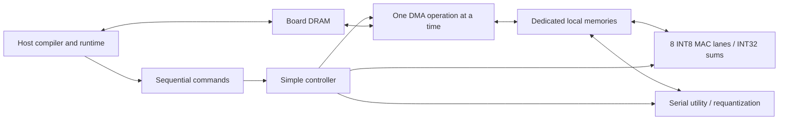
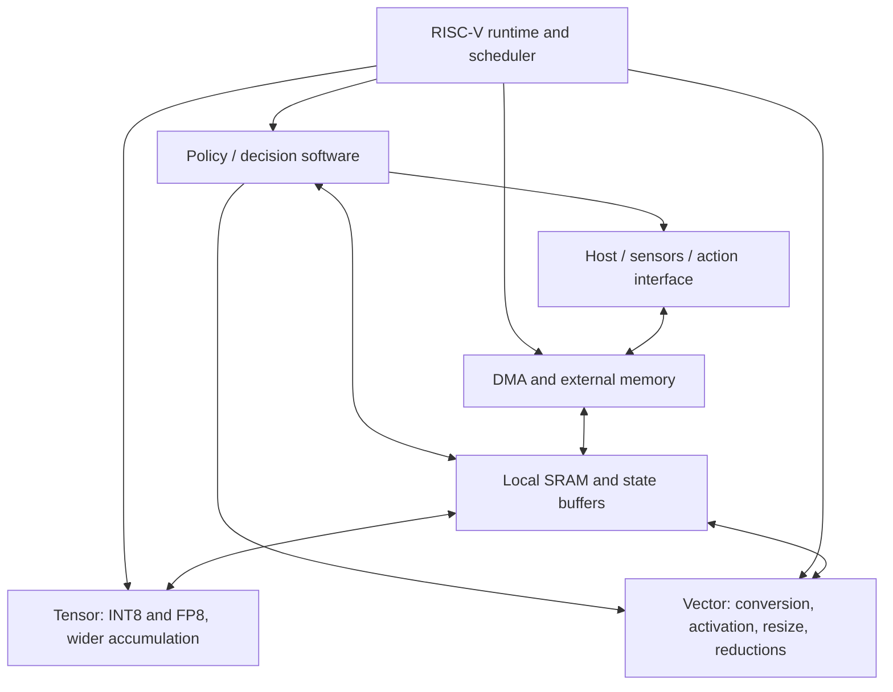

# HASLAB revised architecture: v0, v1, and ASIC

Copyright (C) 2026 Zubin Bhuyan.
SPDX-License-Identifier: CERN-OHL-S-2.0

Status: proposed revision, September 20, 2026. This document supersedes the initial implementation baseline in [the original plan](architecture-plan.md). It is an architecture review and proposal, not a claim of implemented or measured support. No model export, simulator, or RTL is generated at this stage.

**HASLAB remains an open-source physical-AI inference engine for computer vision, robotics, and edge AI.** Its long-term architecture retains FP8/INT8 tensor processing, vector operations, DMA, SRAM, external memory, RISC-V control, and ONNX model ingestion.

The original plan describes a reasonable destination but too many simultaneous projects for a small team's first FPGA. The revised recommendation is a host-controlled INT8 detector accelerator first, an integrated RISC-V/FP8 FPGA second, and a separately sized ASIC later. A useful v0 must produce detections from a real model; a collection of fast GEMM tests is insufficient.

## 1. Review of the original proposal

| Original choice | Implementation concern | Revised decision |
|---|---|---|
| 8×8 systolic array as the starting point | Not intrinsically too large, but skewing, fill/drain, tails, panel generation, and accumulation add work before the full graph runs | Start with eight output-channel MAC lanes and direct tiled convolution |
| GEMM plus generic convolution packing | A small MAC array does not solve patch generation; general packing can become a second accelerator | Bounded 1×1/3×3 convolution address generation; no im2col buffer |
| 256 KiB shared tensor SRAM, eight banks | Bank placement, arbitration, and vector/DMA contention are premature; BRAM shape and ASIC macro availability were not established | Separate input, weight, accumulator, and output memories; about 52 KiB logical storage |
| Four 32-bit vector lanes and broad kernels | Softmax, normalization, resize, depthwise convolution, conversion, and reductions constitute a substantial processor project | One serial utility datapath with only the first detector's required functions |
| INT8 and native FP8 close together | FP decode, subnormals, rounding, FP32 feedback latency, and synthesis cost can delay all model progress | INT8 v0; native E4M3FN in v1 with independently measured throughput |
| RISC-V, firmware SRAM, boot/debug at initial integration | CPU/toolchain/bus/interrupt problems can obscure accelerator bugs | Host controls v0; add an existing RISC-V core in v1 |
| DMA read/write overlap and dependency tokens | Creates ownership, ordering, backpressure, and reset corner cases | One operation at a time in v0; no scoreboard or overlap |
| Descriptor ring with broad addressing/capabilities | More protocol than needed for one trusted static workload | Fixed versioned commands, small FIFO, sequential batch submission, bounded 32-bit device offsets |
| Multiple model families immediately | Attention, recurrent state, depthwise paths, and dynamic semantics multiply coverage requirements | One pinned detector for the v0 release gate |
| YOLO26n/YOLO11n first | Their attention blocks demand more than convolution and elementwise kernels | Use YOLOv8n for v0; add an attention-bearing detector later |
| Generic ONNX Q/DQ and QOperator support together | Many legal quantization forms are outside the proposed numerical profile | Compile a narrow floating-point ONNX profile and calibrate it into HASLAB INT8 first |
| 100 MHz and memory sizes used as reference numbers | Easily mistaken for achieved FPGA feasibility | Retain only illustrative peaks; choose board and confirm resource mapping before freezing |
| Open-source flow presented as a progression to silicon | SRAM, IO, test, packaging, and process collateral remain separate blockers | Establish a small ASIC feasibility gate; do not port FPGA memories blindly |

The original plan correctly retained explicit memory management, INT32 accumulation, no custom CPU ISA, model-independent operations, and strict unsupported-operator reporting. Keep those choices.

## 2. A concrete v0 workload and honest success definition

Choose **YOLOv8n detection, batch one, fixed 320×320 RGB input**, from a pinned upstream release and weight artifact. It is an older member of the current detector family, not the newest model, but provides a substantial anchor-free CNN detector with multi-scale features and a learned detection head. Selecting it is a deliberate complexity reduction, not a proposal to build around obsolete toy networks.

The upstream configuration contains convolution, C2f blocks, SPPF, nearest upsampling, concatenation, and three detection scales. YOLO11/YOLO26 add attention; requiring them first would pull softmax/attention into v0. This is the technical reason to revise the first workload. [YOLOv8 model configuration](https://github.com/ultralytics/ultralytics/blob/main/ultralytics/cfg/models/v8/yolov8.yaml), [Ultralytics architecture comparison](https://docs.ultralytics.com/guides/yolo-architecture)

**v0 success means a complete host+FPGA inference pipeline with all backbone, neck, and learned head convolutions executed on the FPGA.** Residual additions, SiLU, SPPF pooling, and neck upsampling/copies also execute there. The host performs image preparation and the explicitly partitioned final detection tail. It is not standalone FPGA-only inference and must not be advertised as such.

| Stage | Execution location |
|---|---|
| Image decode, letterbox resize, input normalization/quantization | Host |
| Backbone, neck, learned box/class head convolutions | FPGA INT8 engine |
| SiLU, residual addition, max pooling, nearest upsampling, split/concat materialization | FPGA utility engine / DMA |
| Final logit dequantization, DFL softmax/expectation, class sigmoid, box decoding, confidence filtering, NMS | Host |

DFL/decoding can be inside the exported ONNX graph. The compiler must expose this exact host partition; “postprocessing” must not conceal unsupported neural layers elsewhere. Extract the partition automatically without requiring the user to rewrite the model. Preserve final head logits as INT32 plus scale metadata if INT8 output quantization harms detection quality. These are small relative to intermediate feature traffic, but still count their transfer cost.

Before RTL, inspect the actual pinned ONNX export and verify this operator inventory, attributes, shapes, and partition boundary. Upstream documentation does not substitute for that audit. If the export differs, resolve the profile explicitly rather than silently falling back or deleting layers. 640×640 is a later evaluation, not v0's minimum pass criterion.

## 3. v0 FPGA architecture

### Compute: eight lanes, no systolic network

Each cycle, broadcast one signed INT8 activation to eight lanes and read eight corresponding weights from a packed 64-bit weight word. Each lane multiplies and accumulates one output channel. Iterate across input channels and kernel positions. Keep eight INT32 active sums in registers, then spill completed or partial output positions to accumulator SRAM.

Implement dense 1×1 and 3×3 convolution, stride one/two, dilation one, explicit padding, batch one, and masked output-channel tails. Use a simple local patch address generator. A 1×1 operation provides the dense dot-product primitive needed for later GEMM; v0 does not need an independently optimized arbitrary-stride GEMM engine. No depthwise/grouped convolution is required unless the chosen export audit contradicts the profile.

This sacrifices throughput and activation reuse relative to a 2-D array, but removes operand skewing, systolic wavefront control, and global im2col generation. Eight is a practical initial lane count, not a mathematical minimum; one lane could run the model too slowly to be a useful engineering baseline. Physical DSP/LUT utilization is device-dependent and may exceed one DSP per logical lane.

At an illustrative 100 MHz and initiation interval one, peak is **0.8 GMAC/s**, or 1.6 GOP/s counting multiply and add separately. For a graph requiring G GMAC, compute alone takes at least G/0.8 seconds. Do not claim real-time detection. Measure graph MACs after export and add utility, transfer, and control time. If a deadline later requires a larger engine, use measured bottlenecks to size it.

### Numerical profile

Use signed symmetric INT8 activations, per-tensor activation scales, per-output-channel symmetric INT8 weights, and INT32 bias/accumulation. Fold inference batch normalization into convolution weights/bias before calibration. Prove accumulator bounds including bias and full channel reduction; channel tiling does not remove final overflow risk.

Use a shared, serialized fixed-point multiplier/shift unit for conversion, with a wide intermediate, specified ties-to-even rounding, and final saturation. Bias is added once, and requantization occurs after the complete reduction. Specify the exact integer behavior in a software reference before implementation.

For SiLU, map accumulator values into a calibrated common input grid, then use a reloadable 1,024-entry INT8-output LUT. Per-channel input multipliers account for weight scales; output scale is common to the tensor. This is an explicit approximation, including clipping and grid rounding, and its accuracy must be tested. Do not replace SiLU with ReLU or assume an 8-bit intermediate is always adequate. If this LUT profile fails the accuracy gate, revise the grid/utility datapath before RTL freeze.

Residual inputs may have different scales: transform them into a common wider domain, add without intermediate INT8 saturation, then round/saturate once. Concat requires a common output scale or explicit per-input rescaling; it is not always a zero-cost alias. Max pooling must mask out-of-bounds values or use the minimum representable value, not convolution's zero padding.

FP8 hardware, FP16 arithmetic, FP32 reductions, softmax, and reciprocal/square-root hardware are absent in v0. That defers FP8; it does not redefine FP8 as integer emulation.

### Local memory: dedicated scratchpads

| Memory | Logical budget | Access pattern |
|---|---:|---|
| Input / utility scratch | 16 KiB | One selected activation read; utility operands may be read sequentially |
| Weight scratch | 16 KiB | One 64-bit packed read per MAC cycle |
| Partial/output accumulator scratch | 8 KiB | INT32 spill/reload, serialized outside active reduction |
| Output / utility scratch | 8 KiB | Converted outputs and tiled utility results |
| Parameters, LUT, small command FIFO | 4 KiB | Serialized metadata/lookup access |
| **Total** | **52 KiB** | Plus eight active sums, small FIFOs, and control registers |

Logical capacity is not exact BRAM allocation: width/depth rounding and supported primitives affect utilization. No RISC-V firmware SRAM is included in v0. Design memory wrappers around synchronous single-port behavior where practical, with explicit latency, rather than assuming FPGA dual-port memories will exist in an ASIC.

A feasible example tile is eight output channels, an 8×8 spatial output tile, and 32 input channels per reduction chunk. A stride-two 3×3 interior patch needs 17×17×32 = 9,248 input bytes. Weights need 8×3×3×32 = 2,304 bytes. Partial sums need 8×8×8×4 = 2,048 bytes. All fit the proposed stores. Larger channel counts are reduced in chunks; other layers use smaller tiles or spatial tails. A repeated 5×5 pool needs its own halo tiling, also within the input/output budgets.

These are tile capacities, not full-model memory. Weights, intermediate feature maps, branch lifetimes, and command batches reside in external memory. The compiler must calculate peak live external storage; do not assume two global ping-pong buffers suffice for C2f/skip connections. Expect several MiB rather than tens of KiB, and reserve board memory from the actual allocation report.

### Layout and utility operations

Choose one internal blocked channel-last layout with eight-channel groups. Prepack weights offline. Use channel/group/spatial strides in generated copy schedules; mask padding channels. ONNX's logical layout need not match device storage.

The utility block processes elements serially and implements only:

- Requantization and SiLU LUT lookup.
- Residual addition with explicit scale handling.
- 5×5 stride-one max pooling, implemented by a small loop rather than a high-throughput pooling array.
- Nearest-neighbor 2× upsampling with the exact supported coordinate semantics.
- Copy/fill and rescaled copies used for split/concat/layout materialization.

This remains nontrivial hardware, but is a bounded collection of loops rather than a programmable vector processor. Split can be a view only where strides permit; otherwise copy. Preserve branch buffers until their last consumer. Utility and tensor operations never run simultaneously in v0, so they do not need an arbitration network.

### DMA, external memory, and control

Use existing board DRAM through a platform wrapper. A board with an existing processor-to-FPGA bridge is attractive: its CPU can run the host runtime even if it is not RISC-V. This CPU is outside the portable HASLAB core. An external-PC board is also possible if a proven memory/command transport already exists. Avoid creating PCIe, Ethernet, or a DDR controller as an additional v0 project; UART is for debug, not model tensor traffic.

Retain a real DMA engine: contiguous and simple 2-D row copies between board memory and local buffers, one burst transaction in flight, one direction at a time. No scatter/gather, coherence, concurrent channels, or DMA/compute overlap. Define boundaries, unaligned tails, bounds checking, bus-error behavior, and host cache synchronization.

The command sequence is deliberately simple:

`LOAD → COMPUTE → [repeat reduction chunks] → CONVERT/UTILITY → STORE`

Use a small FIFO of fixed versioned commands and status/completion counters. A host runtime submits batches via the existing bridge; the FIFO controller executes each command to completion. DMA generates row/burst loops locally, so the host does not issue a command per element. Do not require a general command-ring fetch engine. Host refill overhead is measured and can motivate v1 changes.

Use 32-bit offsets within a validated device memory aperture. Unsupported commands fail explicitly. On error, stop execution, expose the failing command, mark outputs invalid, and require reset/reload before reuse. This avoids partially completed model recovery in v0.

### ONNX software: narrow but automatic

A small Python compiler should validate the pinned export, fold constants/batch normalization, calibrate INT8, map supported operations, allocate buffers, tile convolution, generate commands, and emit a package with quantization metadata and the declared host tail. Use existing ONNX tools and a host reference runtime; do not build a general compiler framework first.

Accept one documented static opset/export profile. Recognize the necessary Conv, Add, Sigmoid/Mul SiLU pattern, MaxPool, Resize, Concat, Split/Slice, and shape/transpose patterns. Static shape operations can be folded. Match exact semantics and attributes, not node names alone. Final DFL/decoding nodes are assigned to the declared host partition. Reject any unsupported node outside it.

Arbitrary Q/DQ/QOperator ingestion, dynamic shapes, auto-tuning, and multiple layout alternatives are deferred. The v0 calibration path still starts from an ordinary exported ONNX model; it does not ask users to rewrite networks. Packages carry versions, graph/weight hashes, memory requirements, and a required v0 capability profile.

### What counts as a v0 release

1. A pinned full detector runs through the defined host+FPGA pipeline with no hidden fallback or hand-coded network schedule.
2. FPGA integer results match the defined command-level reference; the host tail matches its reference for identical logits.
3. Validate detection accuracy against the same floating-point model at 320×320 on a documented evaluation set. Use a separate calibration set. A proposed budget is no more than one absolute mAP point loss; it is a target to test, not an assured outcome.
4. Publish end-to-end latency, accelerator time, host-tail time, transfer volume, FIFO/control stalls, actual clock, and resource use.
5. Verify DMA errors, tails, resets, boundary padding, accumulation across chunks, differing residual/concat scales, and branch-buffer lifetimes.

If quantization cannot meet the agreed budget, v0 is not complete merely because boxes appear. Resolve the numerical profile, calibrate better, or explicitly reassess scope before implementing more hardware.

## 4. v1 FPGA architecture

v1 should turn the successful detector prototype into a programmable inference subsystem without changing every component at once.

| Area | v1 change | Gate / rationale |
|---|---|---|
| Control | Existing small RV32IMC-class core with required CSR/interrupt support, bare-metal firmware, local firmware SRAM | CPU executes precompiled schedules; it never parses ONNX or computes the network |
| INT8 throughput | Expand to 16/32 lanes or an 8×8 array if profiling supports it | Retain v0 dataflow unless a new array demonstrably improves complete-model latency |
| Native FP8 | E4M3FN arithmetic with a small independently sized FP32 accumulation path | Bit-accurate numerical tests, synthesis fit, model accuracy, and reported initiation interval |
| Memory | Add ping-pong buffers and scale capacity to measured reuse, perhaps 128–256 KiB tensor SRAM | These are exploration sizes, not mandatory budgets; count firmware/accumulators separately |
| DMA | Overlap one transfer with compute on disjoint buffers | Fixed buffer ownership and fences before any general dependency scheduler |
| Vector | Small integer SIMD extension of utility block; measured reduction/nonlinear support | Add functions required by selected workloads, not a generic vector ISA |
| Workloads | 640×640 detector evaluation, one additional detector, small MLP policy | Attention-bearing models require explicit MatMul/softmax support before acceptance |
| Software | Broader ONNX profile, selected Q/DQ input support, device discovery, stable runtime API | Retain strict error reports and versioned target-specific packages |

Integrate RISC-V and transfer overlap before introducing the FP8 datapath so failures remain diagnosable. A v1 completion claim includes native FP8 evidence; an intermediate INT8/RISC-V build should identify itself as such. If FP8 cannot fit the chosen board, revise the board or native lane count openly rather than presenting software conversion as native support.

For FP8, retain FP32 as the default reduction accumulator. FP16 accumulation is a candidate constrained mode only after range and accuracy tests. Wider accumulation costs area and FPGA resources, so native FP8 may initially operate at substantially lower throughput than INT8. There is no need to make INT8 and FP8 share the same physical MAC cells.

The first policy workload can reuse dense tensor operations, clamp/scale/argmax, and a reserved state buffer. Sampling can remain firmware-based. No separate policy hardware block is required to preserve the physical-AI goal.

## 5. Eventual ASIC architecture

The ASIC is a separately validated physical implementation of the proven interfaces and numerical profiles, not an automatic translation of the largest FPGA configuration.

- One small RISC-V controller, no custom CPU ISA or cache coherence initially.
- INT8/INT32 and native FP8/wider-accumulation compute, with lane counts chosen from measured performance per area and memory bandwidth.
- Explicit local tensor memories sized and banked around available characterized SRAM macros.
- A modest vector/utility datapath and DMA with bounded, verified overlap.
- A replaceable external-memory/host interface selected together with actual IO/PHY availability.
- Firmware-managed policy state and action formatting; dedicated policy hardware only if measurements justify it.

Before committing the floorplan, prove arithmetic PPA, SRAM macro integration, clock/reset architecture, power delivery, IO/package feasibility, and test coverage. Add SRAM BIST, scan/test access as appropriate to the selected flow, debug visibility, and reset/error recovery. A manufacturable open-PDK platform needs usable timing/physical libraries and a real fabrication route; an open synthesis/place-and-route flow alone does not supply those. [OpenROAD implementation documentation](https://openroad.readthedocs.io/en/latest/main/README.html)

For the first test chip, a simple host/parallel-memory interface can be preferable to an on-die DDR PHY. Its bandwidth may limit full detector speed; label such a chip as a test vehicle and report that limitation. A deployable edge ASIC needs a memory interface that meets the measured workload traffic. Do not imply that FPGA vendor DRAM IP transfers to an open ASIC design.

Prefer synchronous single-port or otherwise available SRAM organizations, bounded point-to-point data paths, and a small number of clock domains. Avoid depending on abundant FPGA DSPs, arbitrary BRAM ports, and large multiported register arrays. These are the most important portability protections to establish early.

## 6. Where the proposed v4/v5 diagram fits

The diagram is a useful long-term **functional view**, but should not dictate a one-way physical pipeline. Preprocessing also occurs before tensor execution, vector work occurs between layers, and residuals/attention/state require repeated memory accesses. Tensor and vector units should be peers on explicit local buffers.

Retain the intent, with three refinements:

1. **INT8 accumulates in INT32. FP8 defaults to FP32 accumulation.** FP16 accumulation is optional and must earn its place through accuracy/range evidence; it should not be the universal label for both formats.
2. **Elementwise/preprocessing operations live primarily in the vector/utility datapath**, with tensor epilogue fusion only where useful. Avoid duplicate hardware for the same operations.
3. **Policy/decision is initially a software capability using shared primitives and SRAM.** Argmax, clamp, and scale already fit the utility engine; sampling/state do not require an algorithm-specific accelerator.

Version numbers should follow demonstrated capabilities rather than a requirement to build every box. The full integrated physical-AI system may reasonably be v4/v5, while v0 remains a complete, measurable detector implementation.

## 7. Revised release boundary

| | v0 FPGA | v1 FPGA | Eventual ASIC |
|---|---|---|---|
| Purpose | Prove a complete quantized detector | Prove integrated programmable inference and native FP8 | Deliver a physically viable implementation |
| Tensor core | Eight INT8 output-channel MAC lanes | Measured expansion; native FP8 path | PPA- and bandwidth-sized compute |
| Accumulation | INT32 | INT32 / FP32 | INT32 / validated wider FP accumulation |
| Control | Host + sequential controller | RISC-V firmware | RISC-V firmware |
| SRAM | About 52 KiB logical scratch/metadata | Capacity based on traces | Capacity/ports based on real macros |
| DMA | Serialized 1-D/2-D | Bounded overlap, ping-pong | Verified overlap, physical interface constraints |
| Vector work | Serial detector utility kernels | Small SIMD / added measured kernels | Shared vector/utility engine |
| ONNX | One static detector profile | Expanded supported profile | Same model frontend, target-specific lowering |
| Physical AI | Perception outputs usable by a host | Small policy and stateful pipeline | Integrated perception-to-action capability |
| Host work | Image preparation and declared detection tail | Reduced where worthwhile | Product-dependent, explicitly specified |
| Claim | Functional complete host+FPGA detector | Integrated FP8/INT8 inference prototype | Only measured silicon capabilities |

At publication, the next step was the pinned model/operator and quantization feasibility audit, and this revision stopped at architecture. That audit and subsequent software work are now tracked in the [development plan](development-plan.md); this document remains the architectural baseline rather than the current status record.
